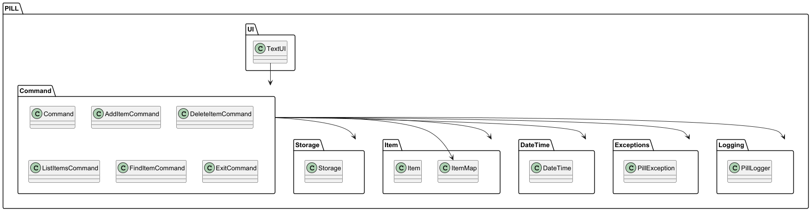
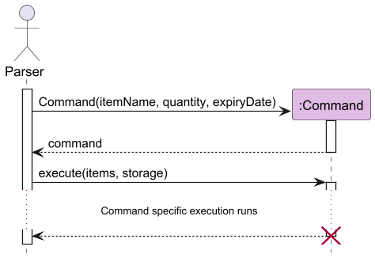
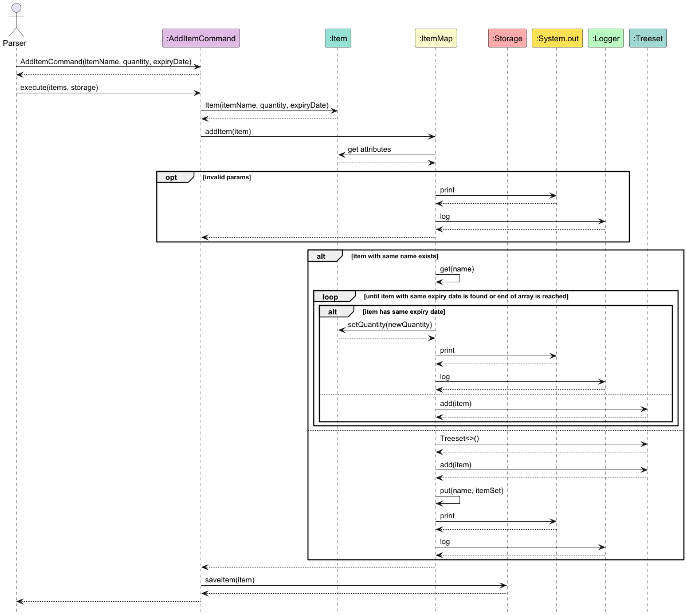
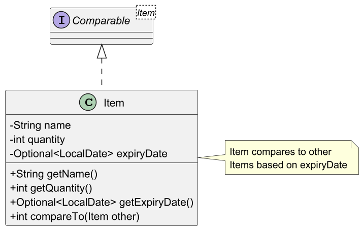
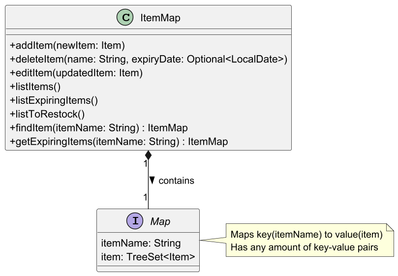
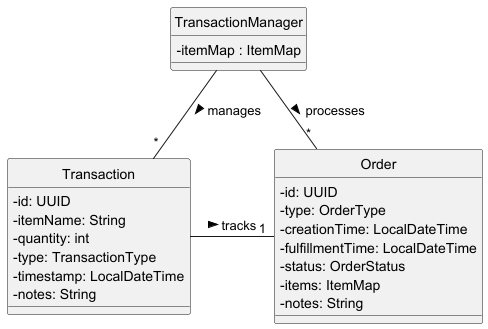
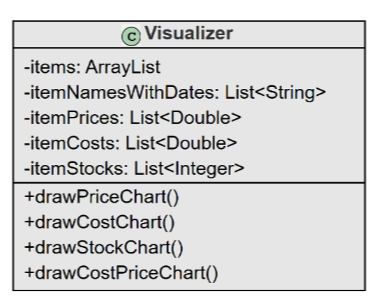
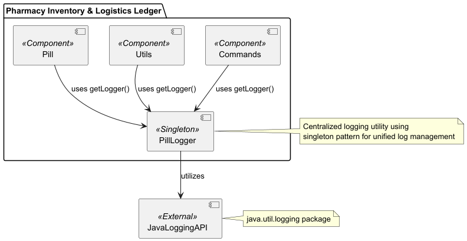

# Developer Guide

## Table of Contents

- [Developer Guide](#developer-guide)
    - [Table of Contents](#table-of-contents)
    - [Acknowledgements](#acknowledgements)
    - [Design & Implementation](#design--implementation)
        - [UI and I/O](#ui-and-io)
        - [Commands](#commands)
        - [Storage](#storage)
        - [Item and ItemMap](#item-and-itemmap)
        - [Orders and Transactions](#orders-and-transactions)
        - [Visualizer](#visualizer)
        - [Parser](#parser)
        - [Exceptions](#exceptions)
        - [Logging](#logging)
    - [Product scope](#product-scope)
        - [Target user profile](#target-user-profile)
        - [Value proposition](#value-proposition)
    - [User Stories](#user-stories)
    - [Non-Functional Requirements](#non-functional-requirements)
    - [Glossary](#glossary)
    - [Instructions for Testing](#instructions-for-testing)
        - [Manual Testing](#manual-testing)
        - [JUnit Testing](#junit-testing)
        - [Text UI Testing](#text-ui-testing)
    - [Future Enhancements](#future-enhancements)

## Acknowledgements

<!-- @@author yijiano -->

PILL uses the following tools for development:
1. [JUnit 5](https://junit.org/junit5/) - Used for testing.
2. [Gradle](https://gradle.org/) - Used for build automation.

## Design & implementation

The project is designed using the Model-View-Controller (MVC) architecture, with the following components:

1. **Model**: Contains the core logic of the application, including the Item, ItemMap, and Storage classes.
2. **View**: The user interface, which is implemented as a command-line interface (CLI).
3. **Controller**: The command classes, which interpret user input and call the appropriate methods from the Model and
   Storage classes.
4. **Storage**: Handles the reading and writing of data to a CSV file.
5. **DateTime**: A utility class to handle date and time operations.
6. **Exceptions**: Custom exceptions to handle printing error messages in a neater way.
7. **PillLogger**: A centralized utility class to handle logging across the entire application.
8. **PillException**: A custom exception class to handle exceptions specific to the PILL application.
9. **Item**: A class to represent an item in the inventory.
10. **ItemMap**: A class to store items in a map-like structure.
11. **Command**: A class to represent a command that can be executed by the application.
12. **Parser**: A class to parse user input and return the corresponding command.
13. **Pill**: The main class that initializes the application and starts the CLI.

### High-Level Overview

The high-level overview of the project structure is as follows:




<!-- @@author cxc0418 -->

### UI and I/O

The program uses a command-line interface (CLI) for interaction with the user.
It receives input as text commands, processes these commands, and provides feedback through the console.

The UI consists of the following components:

1. **Parser**: The Parser class is responsible for interpreting user input and returning the corresponding command.
2. **Command**: The Command class represents a command that can be executed by the application.
3. **Pill**: The main class that initializes the application and starts the CLI.

The UI components work together to provide a seamless user experience, allowing users to interact with the application.

### Commands

Each user action (e.g. adding, deleting, or editing an item) is mapped to a specific command class.
Each specific class inherits from the abstract Command class. These classes handle
the logic for interpreting the input and calling the appropriate methods from the
ItemMap and Storage classes via the usage of polymorphism.

Below is the overview for how Commands are executed from the perspective of the Parser class.



Example:

```
AddItemCommand command = new AddItemCommand(itemName, quantity, expiryDate);
command.execute(itemMap, storage);
```

<!-- @@author yakultbottle -->

#### AddItemCommand

The AddItemCommand intialises an Item with the corresponding name, quantity,
and expiryDate. Then the ItemMap is checked as to whether an Item with exactly
the same name and expiryDate already exists in the ItemMap. If it does, the
corresponding item's quantity is updated to include the new Item's quantity as well.
Else, a new Item entry is added. Finally, the Storage is updated with the corresponding
item.

Not depicted are the print calls to the System.out and Logger classes for brevity.



### Storage

**API**: Storage.java

Entries are stored in Comma Separated Values(CSV) format. Fields read from left
to right are: **Item type**, **Quantity**, and **Expiry date**(optional). Items
may or may not have an expiry date, but all possess an Item type and a Quantity.

Example of stored entries:

```
panadol,1
panadol,30,2024-08-03
panadol,20,2024-08-09
bandage,34
```

The Storage class depends on self-defined classes PillException, Item, and
ItemMap. While it has other dependencies, such as File and FileWriter from
the Java standard library, PillException is the only custom class it depends on.

### Item and ItemMap

The Item class has five private variables, a name, a quantity, an
expiry date, a cost and a price. An Item may or may not have an expiry date, so we store it
as an Optional, which handles empty values for us without using null.



Quantity will always be a positive integer, and if no quantity is specified
in the constructor, the default value is 1. Similarly, if no value is provided
for expiry date, then it will be an Optional.empty().

The ItemMap class contains a key-value pair, implemented as a Map, from the
item name(String) to the item(TreeSet\<Item>)



Each TreeSet\<Item> represents an item type, with each entry in the TreeSet
having a unique expiry date. The TreeSet then orders Items based on the
compareTo method overridden in the Item class, which sorts by the earliest
expiry date to the latest. Items with no expiry date, aka an expiry date of
Optional.empty(), will be the last entry in the TreeSet.

The usage of TreeSet is to facilitate storing multiple batches of items with
different expiry dates and quantities, and to be able to extract items with the
soonest expiry date when taking out of storage.


### Orders and Transactions

<!-- @@author cxc0418 -->

#### Orders

Orders are from the perspective of the Inventory, so purchases are items being
received into the inventory, and dispense refers to items going out of the inventory.
Each order is a collection of one or more items, and is associated to either of the order types: purchase or dispense.

<!-- @@author cnivedit -->

#### Transactions

A transactions represents an inflow/outflow of items to/from the inventory.
Each transaction is associated with a single item and the corresponding order.
When a transaction is created, the inventory is updated to reflect this inflow/outflow by
invoking the `addItem` or `useItem` methods, depending on whether it is an incoming or outgoing transaction.

#### Order Fulfillment

An order is said to be fulfilled when the inflow/outflow of the items ordered have occurred.
Each time an order is fulfilled, a corresponding transaction is created for each individual item in the order and the
order is marked as fulfilled.

#### TransactionManager

The `TransactionManager` class functions as the entry point for all `Order` and `Transaction` related functionalities.
`Pill` instantiates a `TransactionManager`, which handles these functionalities throughout the application.
`TransactionManager` keeps track of all created orders and transactions and handles the interactions within these
classes.

The interaction between the different members of the `TransactionManager` class is better visualized below:



<!-- @@author cxc0418 -->

### Visualizer

The Visualizer class is the core class for handling the visualization of item data.
It leverages the XChart library to generate bar charts for different aspects
of the inventory. It is responsible for providing a graphical view
of item data, such as item prices, costs, and stock levels. This class
enhances the usability of the application by allowing users to better understand
and analyze their inventory data through visual representation.



<!-- @@author yakultbottle -->

### Parser

The Parser class is responsible for interpreting and executing user commands
within the application. It translates raw user input into actionable commands,
checks for common errors, and ensures the commands are executed in a controlled
and predictable way. The class contains several helper methods that assist in
interpreting specific command formats, while the main parseCommand method
coordinates this process.

#### Responsibilities
- Input Parsing: Parser takes a single line of user input, splits it into its
  component parts (command and arguments), and identifies which command the
  user intended to execute.
- Command Dispatching: Based on the parsed command, Parser creates the
  appropriate command object (e.g., AddCommand, DeleteCommand, EditCommand) and
  invokes its execute method.
- Error Handling: All exceptions related to parsing and validation (encapsulated
  in PillException) are handled directly within Parser. This ensures that any
  invalid input or command errors are handled without propagating out.

#### Key Functionalities

1. Command Recognition:
   The first word of each input string determines the command type. For example,
   “add” initiates the AddCommand, while “delete” initiates the DeleteCommand.
   Commands can also support optional flags and arguments, parsed from the
   remaining components of the input.

2. Argument and Flag Parsing:
   After identifying the command, Parser extracts and verifies additional
   arguments, flags, and parameters. Specific commands (e.g., stock-check,
   expiring) have strict requirements on the number and format of arguments, which
   are validated before command execution.

3. Command Execution:
   For each recognized command, the corresponding command object is created and
   its execute method is invoked with any necessary arguments. All command objects
   receive items and storage as parameters, enabling them to interact with the
   application’s data layer.

4. Exception Management:
   Each helper method that parses specific commands may throw a PillException
   for invalid arguments, unsupported commands, or unexpected input formats.
   These exceptions are caught within the parseCommand method, allowing Parser
   to handle error messages consistently across the application.

#### Assumptions

Parser expects commands to follow a specific format. For instance, commands
like `add` require additional arguments, while commands like `list` and `exit`
require none. Only recognized commands will proceed to execution; any unrecognized
command results in a PillException.


### Exceptions

All exceptions are of the PillException type, constructed with an
ExceptionMessages enum value to indicate specific error cases. The
ExceptionMessages enum provides predefined messages accessible through
getMessage(), ensuring consistent error descriptions across the application.
Most importantly, this keeps code of thrown exceptions readable.

Example usage:

```
} catch (NumberFormatException e) {
    throw new PillException(ExceptionMessages.INVALID_INDEX);
```

<!-- @@author cnivedit -->

### Logging

**API**: PillLogger.java



The project uses the `java.util.logging` package for logging, with PillLogger serving as a centralized utility class to
handle logging across the entire application. PillLogger implements the singleton pattern by maintaining a single static
logger instance, which manages log creation, configuration, and output redirection.

#### Key Components

- File Output Configuration: The log level for file output is set by the `fileHandler.setLevel()` call, using
  `Level.ALL` to
  capture all events during execution. The log file, named according to the `FILE_NAME` attribute, is created in the
  directory specified by `PATH`.

- Console Output Configuration: Console output is managed by `consoleHandler.setLevel()`. To maintain a clean terminal
  output for end-users, console logging is set to `Level.OFF` by default, ensuring it is suppressed unless required for
  debugging.

#### Resilience and Error Handling

In the event of a failure in log file creation, PillLogger logs the error to the console and allows the application to
continue running. This design ensures the application’s functionality is not hindered by logging setup issues.

#### API Access

PillLogger exposes a single public method, `getLogger()`, which provides application-wide access to the singleton Logger
instance. Classes within the application use `getLogger()` to record events, without needing to set up or manage their
own
loggers.

<!-- @@author -->

## Product scope

### Target user profile

Pharmacy Inventory & Logistics Ledger (PILL) is designed for personnel responsible for managing and monitoring
pharmaceutical inventories. Target users include pharmacists, pharmacy cashiers, logistics in-charge personnel, and
regional managers in pharmacies or healthcare facilities, particularly those who prefer a command-line interface (CLI)
for its efficiency and simplicity.

### Value proposition

PILL provides a streamlined, user-friendly command-line interface (CLI) to manage pharmaceutical inventory with ease.
This minimalistic tool facilitates quick and efficient inventory operations, tailored to the requirements of pharmacy
staff and logistics managers who need to track stock, monitor expiry dates, and generate reports without unnecessary
complexity.

## User Stories

| Version | As a ...            | I want to ...                             | So that I can ...                                            |
|---------|---------------------|-------------------------------------------|--------------------------------------------------------------|
| v1.0    | new user            | see usage instructions                    | refer to them when I forget how to use the application       |
| v1.0    | pharmacist          | add new medicine stock                    | keep track of new arrivals                                   |
| v1.0    | pharmacy cashier    | remove items from stock                   | remove them from the record when they run out                |
| v1.0    | logistics in-charge | list out all medicines currently stocked  | get an overview of what the pharmacy has at the moment       |
| v1.0    | regional manager    | export all items as a human readable file | compare across multiple outlets                              |
| v1.0    | frequent user       | find items provided a keyword             | find relevant items without having to look through all items |
| v2.0    | logistics in-charge | list all expiring items                   | remember to clear them out                                   |
| v2.0    | logistics in-charge | list all items that need to be restocked  | place orders before items run out                            |

## Non-Functional Requirements

* Technical Requirements: Any *mainstream OS* with Java 17 or above installed.
  Instructions for downloading Java 17 can be found
  [here](https://www.oracle.com/sg/java/technologies/javase/jdk17-archive-downloads.html).
* Project Scope Constraints: The application should only be used for tracking. It is not meant to be involved in any
  form of monetary transaction.
* Project Scope Constraints: Data storage is only to be performed locally.
* Quality Requirements: The application should be able to be used effectively by a novice with little experience with
  CLIs.

## Glossary

- **Mainstream OS**: Windows, Linux, Unix, MacOS
- **CLI (Command-Line Interface)**: A text-based user interface used to interact with software by typing commands.
- **UI (User Interface)**: The components and layout of a software application
  with which users interact, including visual elements like buttons, screens,
  and command prompts that facilitate user interaction with the program.
- **I/O (Input/Output)**: The communication between a program and the external
  environment, such as receiving data from the user (input) or displaying results
  to the user (output).
- **JUnit**: A testing framework for Java that allows developers to write and run
  repeatable automated tests.
- **Gradle**: A build automation tool for Java (and other languages) used to compile, test, and package applications.
- **Text UI Testing**: A form of testing where interactions with a command-line
  interface are tested by simulating user input and validating the application’s text output.
- **Pharmaceutical Inventory**: Refers to the stock of medicines and other medical
  supplies maintained by a pharmacy or healthcare facility for dispensing and logistics.
- **Expiry Date**: The date after which a pharmaceutical product is no longer considered safe or effective for use.
- **Restocking**: The process of replenishing inventory to ensure sufficient supply.

## Instructions for Testing

### Manual Testing

View the [User Guide](UserGuide.md) for the full list of UI commands and
their related use case and expected outcomes.

### JUnit Testing

JUnit tests are written in the [test directory](../src/test/java/seedu/pill/)
and serve to test key methods part of the application.

### Text UI Testing

Files relating to Text UI Testing can be found [here](../text-ui-test/).

To run the Text UI tests, navigate to the `text-ui-test` directory in the terminal.

When running tests on a Windows system, run the following command from the
specified directory:

```
./runtest.bat
```

When running tests on a UNIX-based system, run the following command from the specified directory:

```
./runtest.sh
```

Outcomes of these tests are listed in the below code segment.

```
// Successfully passed all tests
All tests passed!

// Tests failed: 1
```

## Future Enhancements
- Implement the ability to take in special characters in item names.
- Implement a feature to track the price of items.
- Implement a feature to track the cost of items.
- Implement a feature to track the profit of items.
