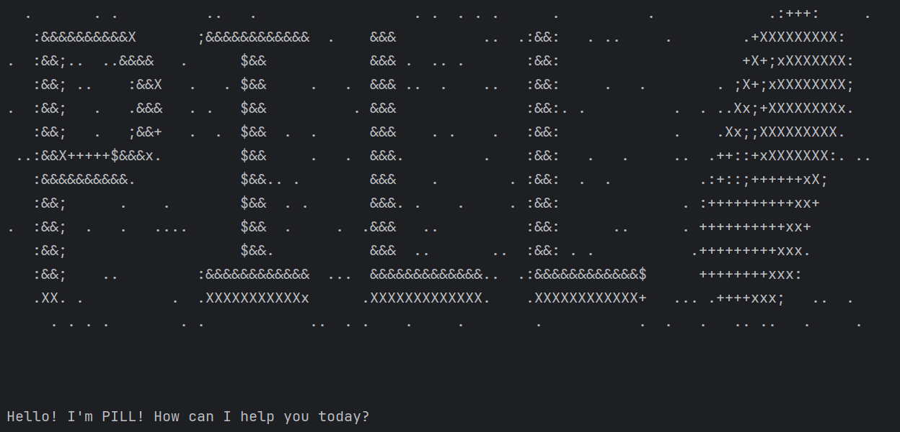

# Pharmacy Inventory & Logistics Ledger (PILL)

Pharmacy Inventory & Logistics Ledger (PILL) is a powerful Command Line Interface (CLI) application that streamlines pharmaceutical inventory management for small to medium pharmacies. It helps pharmacists and inventory managers prevent losses from expired medicines, optimize stock levels, and make data-driven purchasing decisions.

Key features:
- Track inventory levels, costs, and expiry dates in real-time
- Get early warnings about medicines nearing expiry
- Generate insights through interactive data visualizations
- Manage supplier orders and customer transactions efficiently
- Export reports for compliance and business analysis

PILL is designed for users who prefer keyboard-based interactions over GUI applications, offering faster data entry and retrieval through CLI commands.

## Useful links:
* [User Guide](UserGuide.md)
* [Developer Guide](DeveloperGuide.md)
* [About Us](AboutUs.md)
